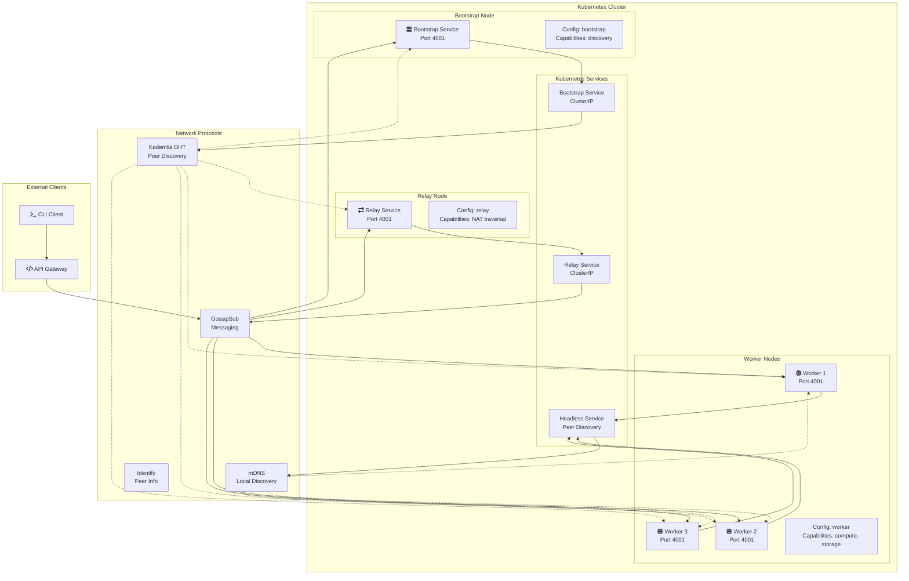

# P2P Network

A distributed peer-to-peer network system built with Rust and libp2p, designed for scalable task distribution and computation across Kubernetes clusters.

## Architecture Overview



## System Components

### Node Roles

1. **Bootstrap Nodes**
   - Initial peer discovery point
   - Maintains network topology
   - Provides stable entry points for new nodes

2. **Relay Nodes**
   - Facilitates NAT traversal
   - Routes messages between isolated networks
   - Handles connection relay for firewalled peers

3. **Worker Nodes**
   - Execute distributed tasks
   - Advertise compute/storage capabilities
   - Participate in task distribution

### Network Protocols

- **GossipSub**: Efficient pub/sub messaging with mesh networking
- **Kademlia DHT**: Distributed hash table for peer discovery
- **mDNS**: Local network peer discovery
- **Identify**: Peer information exchange and verification
- **Ping**: Connection health monitoring
- **DCUTR**: Direct connection upgrade through relay

## Key Features

### Task Distribution
- Decentralized task assignment based on node capabilities
- Reward-based computation incentives
- Fault-tolerant execution with automatic retries

### Cluster Awareness
- Kubernetes-native deployment
- Service discovery via DNS
- Cross-cluster communication support
- Automatic scaling integration

### Security & Reliability
- TLS-encrypted connections
- Peer authentication and verification
- Connection timeouts and health checks
- Graceful failure handling

## Quick Start

### Prerequisites
- Docker
- Kubernetes cluster (minikube, kind, or cloud provider)
- kubectl configured

### Build and Deploy

1. **Build the Docker image:**
   ```bash
   ./build.sh
   ```

2. **Deploy to Kubernetes:**
   ```bash
   ./deploy.sh
   ```

3. **Run tests:**
   ```bash
   ./test.sh
   ```

4. **Run stress tests:**
   ```bash
   ./stress-test.sh
   ```

### Manual Testing

Connect to a running pod:
```bash
kubectl exec -n net-test -it $(kubectl get pods -n net-test -l role=worker -o jsonpath='{.items[0].metadata.name}') -- /bin/bash
```

Submit a test task:
```bash
echo "task compute test_payload" | ./p2p-node --config /app/config.yaml
```

## Configuration

The system uses YAML configuration files with different settings for each node role:

### Worker Node Configuration
```yaml
node:
  role: "worker"
  listen_port: 4001
  capabilities:
    - "compute"
    - "storage"
  max_connections: 100
  heartbeat_interval: 30

network:
  protocol_version: "p2p-network"
  mesh_network: true
  enable_mdns: true
  enable_relay: true
  connection_timeout: 30
```

### Bootstrap Node Configuration
```yaml
node:
  role: "bootstrap"
  listen_port: 4001
  capabilities:
    - "bootstrap"
    - "discovery"
  max_connections: 500
  heartbeat_interval: 10

network:
  protocol_version: "p2p-network"
  mesh_network: true
  enable_mdns: false
  enable_relay: false
  connection_timeout: 60
```

## Network Topology

The system creates a mesh network where:

1. **Bootstrap nodes** serve as stable entry points
2. **Relay nodes** enable communication across network boundaries
3. **Worker nodes** form the computational backbone
4. **Kubernetes services** provide DNS-based discovery
5. **GossipSub** maintains efficient message routing

### Connection Flow

1. New nodes discover bootstrap peers via DNS or configuration
2. Bootstrap provides initial peer list and network topology
3. Nodes establish direct connections or use relays for NAT traversal
4. GossipSub builds mesh networks for efficient message propagation
5. Kademlia DHT enables global peer discovery and routing

## Monitoring & Observability

### Logs
View real-time logs:
```bash
kubectl logs -n net-test -l role=bootstrap -f
kubectl logs -n net-test -l role=worker -f
```

### Network Status
Check peer connections:
```bash
kubectl exec -n net-test -it <pod-name> -- ./p2p-node --config /app/config.yaml
# Then type: peers
```

### Metrics
The system exposes Prometheus-compatible metrics for:
- Peer connection counts
- Message throughput
- Task completion rates
- Network latency
- Node health status

## Development

### Building from Source
```bash
# Clone the repository
git clone <repository-url>
cd p2p-network

# Build the application
cargo build --release

# Run tests
cargo test

# Run with custom config
cargo run -- --config config.yaml
```

### Docker Development
```bash
# Build development image
docker build -t p2p-network:dev .

# Run with mounted config
docker run -v $(pwd)/config.yaml:/app/config.yaml -p 4001:4001 p2p-network:dev
```

## API Reference

### CLI Commands
- `help` - Show available commands
- `peers` - List connected peers
- `status` - Show node status
- `task <type> <payload>` - Submit a task
- `capabilities` - Show node capabilities

### Message Types
- `TaskRequest` - Distributed task assignment
- `TaskResponse` - Task execution results
- `CapabilityAdvertisement` - Node capability broadcast
- `HeartBeat` - Connection health signals

## Troubleshooting

### Common Issues

1. **Bootstrap Connection Failed**
   - Check DNS resolution: `nslookup p2p-bootstrap.net-test.svc.cluster.local`
   - Verify service configuration in Kubernetes
   - Check firewall rules for port 4001

2. **Peer Discovery Issues**
   - Enable mDNS in configuration for local networks
   - Verify bootstrap node accessibility
   - Check network policies in Kubernetes

3. **Task Distribution Problems**
   - Ensure worker nodes have required capabilities
   - Check GossipSub topic subscriptions
   - Verify network connectivity between nodes

### Debug Mode
Run with debug logging:
```bash
RUST_LOG=debug cargo run -- --config config.yaml
```

## Contributing

1. Fork the repository
2. Create a feature branch
3. Make your changes
4. Add tests for new functionality
5. Submit a pull request

## License

This project is licensed under the MIT License - see the LICENSE file for details.